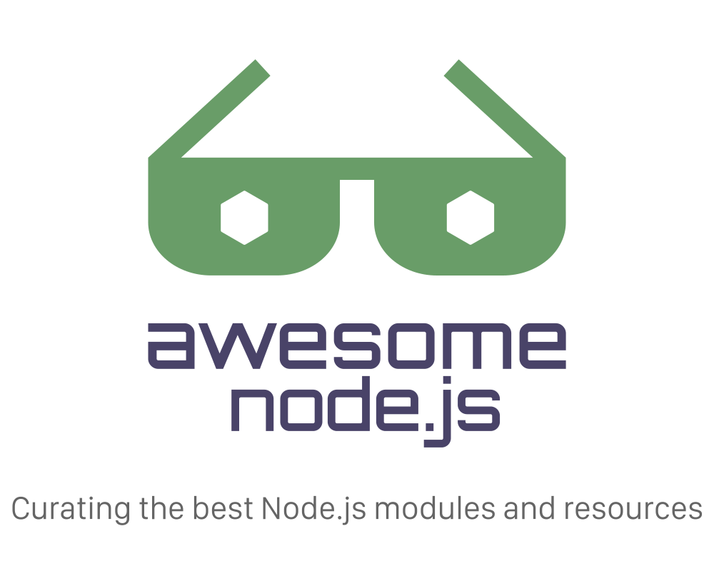

[Awesome]: icons/awesome.svg "star > 2000"
[Green]: icons/Green.svg "最近一周有更新"
[Yellow]: icons/Yellow.svg "最近一年没有更新"
[Archived]: icons/archived.svg "项目已归档"
      

	

		
	

	 
	

	

		

			
				<a href="https://github.com/sponsors/sindresorhus">My open source work is supported by the community</a>
			
		

		Special thanks to:
		 
		 
		
		 
		 
		
		 
		 
		<a href="https://doppler.com/?utm_campaign=github_repo&utm_medium=referral&utm_content=awesome-node&utm_source=github">
			

				
			

			<b>All your environment variables, in one place</b>
			

				Stop struggling with scattered API keys, hacking together home-brewed tools,
				 
				and avoiding access controls. Keep your team and servers in sync with Doppler.
			

		</a>
		 
		<a href="https://workos.com/?utm_campaign=github_repo&utm_medium=referral&utm_content=awesome-nodejs&utm_source=github">
			

				
			

			<b>Your app, enterprise-ready.</b>
			

				Start selling to enterprise customers with just a few lines of code.
				 
				Add Single Sign-On (and more) in minutes instead of months.
			

		</a>
		 
		<a href="https://strapi.io/?ref=sindresorhus">
			

				
			

			<b>Strapi is the leading open-source headless CMS.</b>
			

				It’s 100% JavaScript, fully customizable, and developer-first.
			

		</a>
		 
		<a href="https://oss.capital">
			

				
			

			

				<b>Founded in 2018, OSS Capital is the first and only venture capital platform focused exclusively on supporting early-stage COSS (commercial open source) startup founders.</b>
			

		</a>
		 
		 
		<a href="https://www.gitpod.io/?utm_campaign=sindresorhus&utm_medium=referral&utm_content=awesome&utm_source=github">
			

				
			

			<b>Dev environments built for the cloud</b>
			

				
				Natively integrated with GitLab, GitHub, and Bitbucket, Gitpod automatically and continuously prebuilds dev
				 
				environments for all your branches. As a result team members can instantly start coding with fresh dev environments
				 
				for each new task - no matter if you are building a new feature, want to fix a bug, or work on a code review.
				
			

		</a>
	

	

	 
	 
	 
	 
	 
	
	

		Just type <a href="https://node.cool"><code>node.cool</code></a> to go here. Follow me on <a href="https://twitter.com/sindresorhus">Twitter</a>.
	

	 
	

		<a href="https://en.wikipedia.org/wiki/Node.js">Node.js</a> is an open-source, cross-platform, JavaScript runtime for writing servers and command-line tools.
	

	 

**此项目是 [awesome-nodejs](https://raw.githubusercontent.com/sindresorhus/awesome-nodejs/master/readme.md) 中文版，每天定时同步（上次同步时间：2021-08-30 08:19:00）**

顺便推荐一个 Go 的中文列表 [awesome-go-cn](https://github.com/yinggaozhen/awesome-go-cn/)

**小图标说明** :

小图标 | 说明  
:-:|-
![awesome][Awesome] | star > 2000
![最近一个周有更新][Green] | 最近一周有更新。可以基本判断当前库处于积极维护状态。
![最近一年未更新][Yellow] | 最近一年没有更新。反应了此库的维护积极性不高，使用时需谨慎。
![归档项目][Archived] | 此项目已归档，不再更新，使用时需谨慎。
              
## 内容

